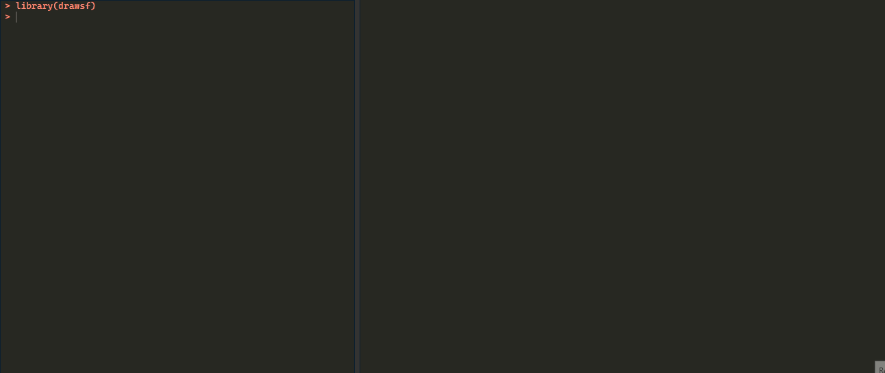

# drawsf

<!-- badges: start -->
<!-- badges: end -->

Draw geometries interactively in R and return them as [`sf`](https://r-spatial.github.io/sf/) objects.



## Installation

You can install the development version of drawsf like so:

``` r
# install.packages("pak")
pak::pkg_install("jslth/drawsf")
```
